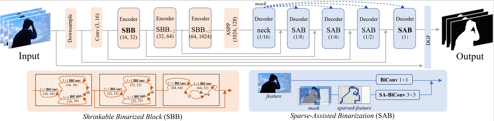

# BiMatting: Efficient Video Matting via Binarization
This project is the official implementation of our accepted NeurIPS 2023 paper *BiMatting: Efficient Video Matting via Binarization* [[PDF](https://openreview.net/pdf?id=YbYQ0JEQ80)]. Created by researchers from Beihang University and ETH Zürich.



## Introduction

Real-time video matting on edge devices faces significant computational resource constraints, limiting the widespread use of video matting in applications such as online conferences and short-form video production. Binarization is a powerful compression approach that greatly reduces computation and memory consumption by using 1-bit parameters and bitwise operations. However, binarization of the video matting model is not a straightforward process, and our empirical analysis has revealed two primary bottlenecks: severe representation degradation of the encoder and massive redundant computations of the decoder. To address these issues, we propose **BiMatting**, an accurate and efficient video matting model using binarization. Specifically, we construct shrinkable and dense topologies of the binarized encoder block to enhance the extracted representation. We sparsify the binarized units to reduce the low-information decoding computation. Through extensive experiments, we demonstrate that BiMatting outperforms other binarized video matting models, including state-of-the-art (SOTA) binarization methods, by a significant margin. Our approach even performs comparably to the full-precision counterpart in visual quality. Furthermore, BiMatting achieves remarkable savings of 12.4$\times$ and 21.6$\times$ in computation and storage, respectively, showcasing its potential and advantages in real-world resource-constrained scenarios.

## Dependencies

```bash
# Go to the default directory
pip install -r requirements.txt
```

## Execution

```bash
# We provide script to train and test our model
sh scripts/train.sh
sh scripts/test.sh
```

## Results

|        | VM512x512 |         |          |          |           |         |         | VM1920x1080 |         |          |            |
|--------|-----------|---------|----------|----------|-----------|---------|---------|-------------|---------|----------|------------|
|        | pha_mad   | pha_mse | pha_grad | pha_conn | pha_dtssd | fgr_mad | fgr_mse | pha_mad     | pha_mse | pha_grad | pha_dtssd  |
| stage1 | 15.06     | 8.75    | 2.83     | 1.76     | 2.70      | 42.46   | 14.81   | 19.33       | 11.63   | 27.73    | 3.42       |
| stage2 | 13.50     | 7.02    | 3.32     | 1.52     | 2.69      | 46.28   | 15.39   | 19.68       | 11.80   | 29.64    | 3.39       |
| stage3 | 12.67     | 6.89    | 2.78     | 1.40     | 2.65      | 39.07   | 13.30   | 17.95       | 11.41   | 22.13    | 3.18       |
| stage4 | 12.82     | **6.65**    | **2.97**     | **1.42**     | **2.69**      | **363.69**  | **213.77**  | **17.71**       | **10.79**   | 22.10    | 3.24       |
| paper  | 12.82     | 6.65    | 2.97     | 1.42     | 2.69      | 363.69  | 213.77  | 18.16       | 11.15   | 21.90    | 2.25       |


## Citation

If you find our work useful in your research, please consider citing:

```shell
@inproceedings{qin2023bimatting,
    author={Haotong Qin and Lei Ke and Xudong Ma and Martin Danelljan and Yu-Wing Tai and Chi-Keung Tang and Xianglong Liu and Fisher Yu},
    title={BiMatting: Efficient Video Matting via Binarization},
    booktitle={Thirty-seventh Conference on Neural Information Processing Systems},
    year={2023},
}
```
